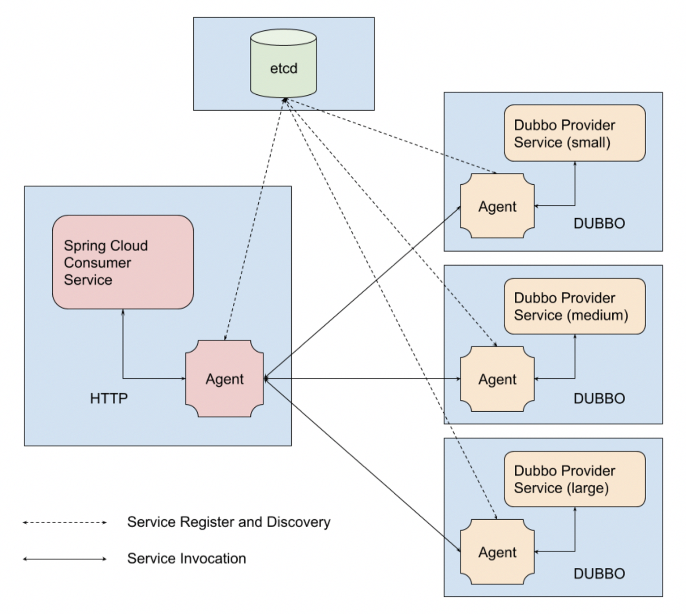
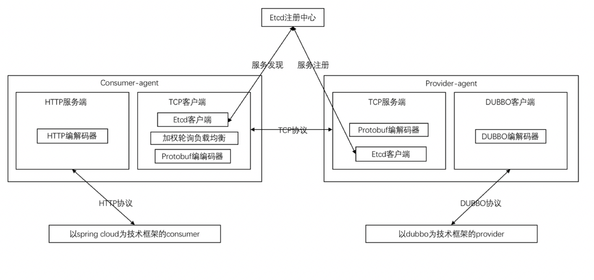

# dubbo-service-mesh
赛题：https://code.aliyun.com/middlewarerace2018/docs.git  
原来的dubbo服务调用是consumer去注册中心获取provider的信息然后直接向provider调用，如果服务之间的通信协议不同，例如有dubbo协议和http协议，那么很难实现不同技术框架不同协议建设的服务之间的互联互通，因此为了解决这个，阿里中间件团队设定的这个赛题是希望通过一个高可用的agent作为服务调用的代理，当consumer去调用服务的时候，只向同一容器内的consumer-agent请求，然后consumer-agent具有负载均衡、服务发现等功能，然后向provider-agent发送请求，再由provider-agent向provider请求，也就是说consumer到provider的请求是经过了额外的两次agent处理，这种方式虽然增加了网络开销，但是如果在不同协议之间转化的话可用性高，对于大型分布式系统服务化是一种可用的解决方案，并且也降低了服务治理和服务的耦合。
  赛题主要实现的是一个通用的agent，通过jvm启动参数区别consumer和provider，并于consumer或provider部署在同一容器下。图中每个蓝色的方框代表一个 Docker 实例，全部运行在一台宿主机上。最上面的一个实例运行有 etcd 服务，左边的一个实例运行有 Consumer 服务及其 Agent，而右边的三个实例运行有 Provider 服务及其 Agent。从图中可以看出，Consumer 和 Provider 并不会直接通讯，所有进出服务的流量都需要经过 Agent 中转。

2. 思路说明
   我采用的是java语言实现agent，而整个赛题agent的实现最关键的就是网络传输的性能，java生态圈来说首选的肯定就是netty，特别如果agent之间的传输能做到异步传输，那么整个agent的性能就有巨大的提升，在实现了异步消息传输之后，512并发下的QPS达到了5000+，netty的线程模型就是实现这个的根本，我在每个消息里面加入了消息的id，每次消息传输的都是都带着id，并且采用异步的方式，而处理返回结果就根据消息id即可。随后又对传输的序列化方式进行了改良，刚开始一直采用jdk原生的序列化方式效果不好，在改成protobuf之后性能得到了较大的提升，QPS在5500+。负载均衡算法也是一个可以改良的点，demo中采用随机的负载均衡算法，我将其改为加权轮询的算法，最终QPS在5700。

   

3. 问题优化

4. Netty我采用的是socket，但是在linux内部采用epoll的方式效果更佳。

5. 在256并发下，我的方案QPS达到了4200+，效果算挺好的，但在512并发下，出现了许多异常，这是因为大量的请求将provider的dubbo线程池撑爆了（dubbo线程池默认200），看到其他选手的方案，有一些解决方案，例如我的方案中将负载均衡的比例设置为1:2:3，但经过测试设置为1:2:2就可以，还有一些选择熔断、降级的方式。

6. Netty大都采用主从线程模型，我设置主从线程数都是4个，但其实可以更优化，例如在provider-agent中设置主线程数为1个。
